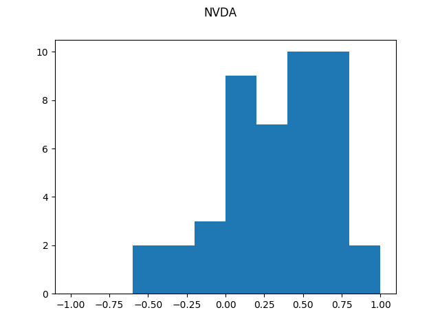
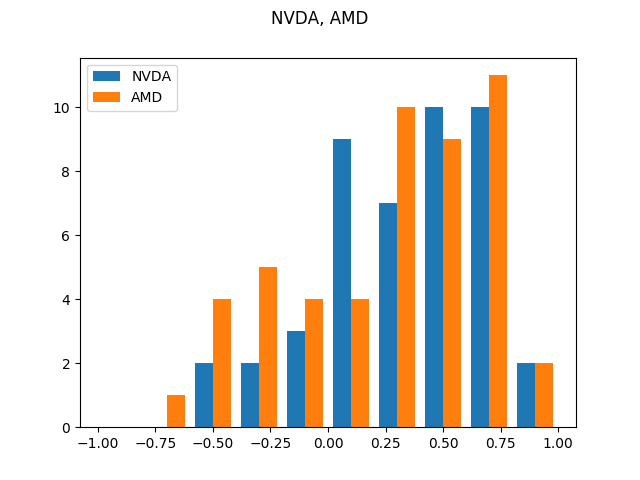

# StockNewsAnalyzer

Performs text analysis and scores Articles written for, or mentioning a particular Stock.

## Installation

1. Clone the repo into your desired directory, step into the directory:

```bash
git clone https://github.com/William-Lake/StockNewsAnalyzer.git

cd StockNewsAnalyzer
```

2. (Optional, but *highly recommended*.) create your virtual environment:

NOTE: Conda is not required, but it's what was used when creating this library.

```bash
conda create --name=StockNewsAnalyzer_env python=3
```

3. Install the required libraries:

NOTE: *No requirements.txt is currently provided, but will be in the future. See the section 'Built With' for more info on what to install.*
```bash
pip3 install -r requirements.txt
```

## Usage

There are three separate tools in this repo:

1. StockNewsAnalyzer - Analyzes a Stock's News articles.
2. StockRater - Aggregates ratings of a stock from other rating sites.
3. HistogramGenerator - Generates a histogram for a Stock's News scores.

### StockNewsAnalyzer

```bash
python3 stock_news_analyzer.py NVDA
```

Output:
```
Average Sentiment Score for NVDA: 0.3212948148148148
```

### StockRater

```bash
python3 stock_rater.py NVDA
```

Output:
```
Average Buy/Hold/Sell rating for NVDA: 0
```

### HistogramGenerator

#### One Stock

```bash
python3 histogram_generator.py NVDA
```



#### Multiple Stocks

```bash
python3 histogram_generator.py NVDA AMD
```



## Built With

- [peewee](https://pypi.org/project/peewee/): Peewee is a simple and small ORM. It has few (but expressive) concepts, making it easy to learn and intuitive to use.
    - Also made use of it's [pwiz script](http://docs.peewee-orm.com/en/latest/peewee/playhouse.html#pwiz-a-model-generator) which was incredibly useful.
- [feedparser](https://pypi.org/project/feedparser/)
- [requests](https://pypi.org/project/requests/)
- [nltk](https://pypi.org/project/nltk/)
- [vaderSentiment](https://pypi.org/project/vaderSentiment/)
- [matplotlib](https://pypi.org/project/matplotlib/)
- [numpy](https://pypi.org/project/numpy/)
